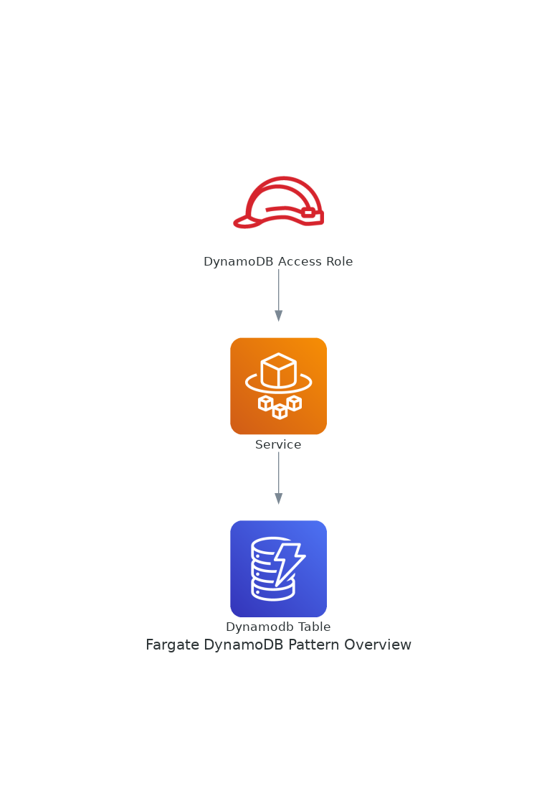

# onp.aws.bootstrap.deployment.fargate-dynamodb 

## Metadata
| attribute               | value                                         |
| ----------------------- | --------------------------------------------- |
| pattern-id              | onp.aws.bootstrap.deployment.fargate-dynamodb |
| pattern-name            | fargate-dynamodb                              |
| pattern-version         | 1.0.1                                         |
| pattern-description     | Implement an AWS Fargate service that can write/read to an Amazon DynamoDB table, https://docs.aws.amazon.com/solutions/latest/constructs/aws-fargate-dynamodb.html deployments.                                                              |
| organisation-id         | onp                                           |
| pattern-categories      | bootstrap                                     |

## What is this pattern?
Implement an AWS Fargate service that can write/read to an Amazon DynamoDB table.
Out of the box implementation of the Construct without any override will set the following defaults:

### AWS Fargate Service
Sets up an AWS Fargate service
Uses the existing service if provided
Creates a new service if none provided.

Service will run in isolated subnets if available, then private subnets if available and finally public subnets
Adds environment variables to the container with the ARN and Name of the DynamoDB table
Add permissions to the container IAM role allowing it to publish to the DynamoDB table

### Amazon DynamoDB Table
Sets up an Amazon DynamoDB table
Uses an existing table if one is provided, otherwise creates a new one
Adds an Interface Endpoint to the VPC for DynamoDB (the service by default runs in Isolated or Private subnets)

## What are the use cases?
- Serverless deployment of a container based application wich uses dynamodb as the data store

## Variables

| Variable               | Source                                         | Value |
| -----------------------| --------------------------------------------- | ------|
| Deployment bucket ARN             | SSM Parameter | onp/bootstrap/deploymentbucket|
